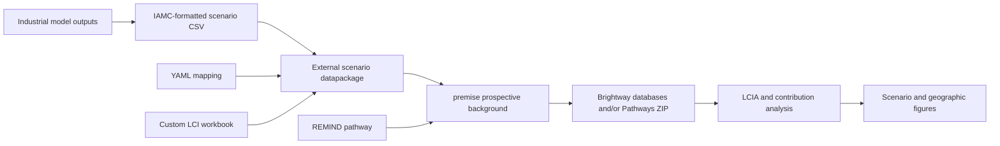

# LCA_TRANSIENCE

### Prospective Life Cycle Assessment Framework for Industrial Transition Pathways

[]()
[](LICENSE)

**LCA_TRANSIENCE** is an open and modular framework for **prospective life cycle assessment (LCA)** of future industrial systems. It connects scenario results from integrated assessment and industrial optimization models to foreground life cycle inventories, prospective background databases, and environmental impact calculations.

The framework was developed within the **TRANSIENCE Horizon Europe project**. Its current implementation combines:

- Integrated Assessment Model (IAM) pathways from REMIND;
- sector and technology pathways from TRANSIENCE models such as ITOM, FORECAST, EDM-I, and Open-PROM;
- custom foreground inventories for emerging and transformed industrial processes;
- prospective background inventories generated with [`premise`](https://github.com/polca/premise);
- scenario calculations and contribution analysis with [`pathways`](https://github.com/polca/pathways) and Brightway.

The main case study represents the **Port of Rotterdam (PoR)** chemical cluster under the **CL** and **OCE** scenarios. The architecture is transferable to other industrial clusters, sectors, technologies, and regions.

> [!IMPORTANT]
> This repository is a research workflow, not a turnkey LCA model. Reproducing a result requires a compatible ecoinvent database, valid `premise` access, the relevant scenario input files, and consistency among the scenario CSV, YAML mapping, inventory workbook, datapackage descriptor, and ecoinvent version.

## Contents

- [What the framework does](#what-the-framework-does)
- [Audience, scope, and conceptual model](#audience-scope-and-conceptual-model)
- [Workflow at a glance](#workflow-at-a-glance)
- [Repository structure](#repository-structure)
- [Installation and access](#installation-and-access)
- [Pre-flight checklist](#pre-flight-checklist)
- [Quick start: Port of Rotterdam](#quick-start-port-of-rotterdam)
- [Detailed workflow](#detailed-workflow)
- [Data contracts and file formats](#data-contracts-and-file-formats)
- [How scenario mappings work](#how-scenario-mappings-work)
- [Port of Rotterdam modelling conventions](#port-of-rotterdam-modelling-conventions)
- [Current external scenario modules](#current-external-scenario-modules)
- [Interpreting results](#interpreting-results)
- [Result data and figure outputs](#result-data-and-figure-outputs)
- [Validation and reproducibility](#validation-and-reproducibility)
- [Assumptions, provenance, and review](#assumptions-provenance-and-review)
- [Troubleshooting](#troubleshooting)
- [Extending the framework](#extending-the-framework)
- [Data requirements and limitations](#data-requirements-and-limitations)
- [Applications](#applications)
- [Related repositories](#related-repositories)
- [Contributors and acknowledgement](#contributors-and-acknowledgement)
- [License and citation](#license-and-citation)

## What the framework does

LCA_TRANSIENCE translates modelled industrial transitions into prospective environmental inventories. It is designed to answer questions such as:

- How do alternative industrial transition scenarios change total environmental burdens over time?
- Which products, technologies, supply chains, or life-cycle stages drive those changes?
- How do foreground choices interact with a decarbonizing background economy?
- Which burdens occur in activities located in the Netherlands, explicitly outside the Netherlands, or in geographically aggregated supply chains?
- How sensitive are results to technology deployment, imports, carbon capture and storage, recycling, and energy assumptions?

The framework deliberately separates four kinds of information:

1. **Scenario quantities** — annual production, trade, energy, and technology deployment from external models.
2. **Mapping logic** — rules that connect scenario variables to production pathways and markets.
3. **Inventory content** — process-level technosphere and biosphere exchanges.
4. **Prospective background assumptions** — economy-wide changes supplied by the IAM and implemented by `premise`.

This separation makes it possible to update model results without rewriting inventories, or to improve an inventory without changing the external scenario data.

## Audience, scope, and conceptual model

### Intended users

The repository is intended for researchers and analysts who are comfortable with at least one of the following areas:

- life cycle inventory modelling in ecoinvent and Brightway;
- prospective LCA with `premise`;
- industrial-energy or technology-optimization model outputs;
- IAMC-formatted scenario data;
- Python and notebook-based scientific workflows.

New users do not need to understand every model internally, but they do need to understand the physical meaning, unit, geography, and system boundary of every scenario variable they connect to an LCI.

### What is inside and outside the model

The PoR implementation models annual production associated with the chemical and petrochemical cluster and connects that foreground system to prospective upstream supply chains. Its exact boundary depends on the active ITOM variables and YAML replacements.

Conceptually, the calculation includes:

- foreground production and transformation activities represented by PoR inventories;
- imported intermediates and feedstocks represented through external suppliers;
- electricity, steam, heat, fuels, transport, and material inputs linked to background inventories;
- direct emissions and selected carbon-capture or storage exchanges;
- prospective upstream changes from the REMIND/`premise` background;
- annual scenario-dependent production volumes and supplier shares.

It does not automatically include:

- every industrial activity physically located in the port;
- capital goods or infrastructure omitted from the selected inventories;
- transport burdens where the transport distance is unknown and no explicit assumption is supplied;
- emissions or flows present only as economic bookkeeping in ITOM unless they are deliberately mapped;
- a spatial distinction between the Port of Rotterdam and other activities carrying the generic `NL` location;
- consequences outside the attributional cut-off system model unless explicitly represented.

### Foreground, background, and scenario layers

| Layer | Role | Typical source | Main files |
|---|---|---|---|
| Industrial scenario | Determines how much is produced, imported, exported, stored, or supplied by each route | ITOM, FORECAST, EDM-I, Open-PROM | `scenario_data/*.csv` |
| Mapping | Translates scenario variables into LCI pathways and market shares | Analyst-defined configuration | `configuration_file/*.yaml` |
| Foreground inventory | Describes material, energy, emission, and service exchanges per unit of product | ecoinvent adaptations and technology data | `inventories/*.xlsx` |
| Prospective background | Changes electricity, fuels, materials, transport, and other upstream systems over time | REMIND through `premise` | Generated inside the package workflow |
| Impact assessment | Characterizes inventory flows and aggregates contributions | Brightway methods through `pathways` | `2_calc_impacts.ipynb` |
| Geographic attribution | Groups contribution results by activity location | Result metadata | `3_regionalization_impacts.ipynb` |
| Regionalized LCIA | Applies location-specific characterization, then attributes contributions geographically | EDGES through Pathways | `4_edges_regionalized_impacts.ipynb` |

### Key terminology

| Term | Meaning in this repository |
|---|---|
| **IAMC data** | A wide scenario table with model, scenario, region, variable, unit, and year columns. |
| **External scenario** | A `premise` datapackage that modifies foreground technologies or markets using non-IAM scenario data. |
| **Production pathway** | A YAML entry connecting one scenario volume to one provider activity. |
| **Market** | A scenario-dependent mixture of production pathways that can replace selected supplier exchanges. |
| **Foreground variable** | A scenario variable selected as a functional demand for Pathways calculations, commonly prefixed with `FE_` after package construction. |
| **Reference database** | A Brightway database used to inspect and link custom inventories before future transformations are applied. |
| **Prospective database** | A scenario- and year-specific database containing future background and foreground transformations. |
| **Contribution** | The characterized impact associated with a contributing activity, product, location, or classification. |
| **Credit** | A negative contribution caused by a negative exchange, avoided product, substitution, or carbon-storage convention. |
| **Aggregate geography** | A location such as `RER`, `EUR`, `GLO`, or `RoW` that cannot be assigned to one country from the result metadata alone. |

## Workflow at a glance



For the PoR case, the normal execution order is:

1. Convert the CL and OCE ITOM workbooks with `0_convert_ITOM_por_to_IAMC.py`.
2. Review the scenario data, YAML mapping, and custom inventory workbook.
3. Run `1_export_packages.ipynb` to assemble the prospective scenarios and create `remind-transience_por.zip` and/or Brightway databases.
4. Run `2_calc_impacts.ipynb` to calculate and export LCA results.
5. Run `3_regionalization_impacts.ipynb` to compare the activity-location distribution of impacts.
6. Run `4_edges_regionalized_impacts.ipynb` for location-specific water-scarcity, particulate-matter and acidification characterization using EDGES.

## Repository structure

```text
lca_transience/
├── 0_convert_ITOM_por_to_IAMC.py   # Convert CL and OCE ITOM outputs to IAMC data
├── 0_export_act_to_excel.py        # Extract candidate ecoinvent activities for LCI development
├── 1_export_packages.ipynb         # Build prospective databases and the Pathways package
├── 2_calc_impacts.ipynb            # Calculate LCIA results and scenario figures
├── 3_regionalization_impacts.ipynb # Attribute results by activity location
├── 4_edges_regionalized_impacts.ipynb # EDGES regionalized LCIA and geographic comparisons
├── config.py                       # Brightway project and ecoinvent settings
├── configuration_file/             # External-scenario YAML mappings
├── inventories/                    # Custom Excel inventory workbooks
├── scenario_data/                  # IAMC scenario CSVs and source model workbooks
├── datapackage_*.json              # External-scenario datapackage descriptors
├── supplier_resolution.py          # Shared supplier identities and active-IAM geography
├── regionalization.py              # Legacy compatibility only; no longer used by the exporter
├── primary_vs_secondary_metals/    # Supporting metal-market transformation code
├── figs/                           # Generated figures and selected plot data
├── lca_transience.yml              # Conda environment specification
└── README.md
```

### Generated files

The workflow can produce large local artifacts, including:

- `remind-transience_por.zip` — the Pathways datapackage used for calculations;
- scenario-specific Brightway databases;
- `results_YYYYMMDD_HHMMSS.gzip` — exported calculation results;
- `pathways.log`, `edges.log`, and `unlinked.log` — diagnostic logs;
- PNG and PDF figures in `figs/`.

Most generated databases, archives, credentials, and temporary files should remain local. Check `.gitignore` before adding outputs to version control.

## Installation and access

### Prerequisites

You need:

- Git;
- Conda or Mamba;
- Python 3.11;
- a licensed ecoinvent account with access to the required database release;
- a valid `premise` key;
- JupyterLab, Jupyter Notebook, or an IDE capable of running notebooks;
- the project-specific scenario files required by the modules you activate.

The supplied environment currently pins the principal modelling stack, including Brightway, `premise`, `pathways`, pandas, openpyxl, pyarrow, matplotlib, and seaborn.

### Clone and create the environment

```bash
git clone https://github.com/tomterlouw/lca_transience.git
cd lca_transience
conda env create -f lca_transience.yml
conda activate premise_pathways
```

If you use Mamba, the equivalent creation command is:

```bash
mamba env create -f lca_transience.yml
```

### Configure credentials

Create a local `private_keys.py` in the repository root:

```python
USER_NAME = "your-ecoinvent-username"
USER_PW = "your-ecoinvent-password"
KEY_PREMISE = "your-premise-key"
```

`private_keys.py` is ignored by Git. Never commit credentials, include them in a notebook output, or share them with a generated datapackage.

### Check the project configuration

The central settings are in `config.py`:

```python
EI_VERSION = "3.12"
DB_NAME_INIT = "ecoinvent-3.12-cutoff"
PROJECT_NAME = "por"
NAME_REF_DB = "ecoinvent_312_reference"
BIOSPHERE_DB = "ecoinvent-3.12-biosphere"
```

Before running the notebooks, confirm that these names match the Brightway project and database names on your machine. The main PoR and Open-PROM datapackages currently target ecoinvent 3.12 cut-off. Some other module descriptors still identify ecoinvent 3.10; see [Current external scenario modules](#current-external-scenario-modules). Do not combine modules across versions without validating inventory compatibility and provider linking.

### Verify the environment

After activation, verify that the notebook kernel and command line resolve the same environment:

```bash
python --version
python -c "import bw2data, premise, pathways, pandas, pyarrow; print('Environment imports OK')"
```

The expected Python major/minor version is 3.11. If Jupyter displays a different interpreter, register or select the `premise_pathways` kernel before executing notebooks.

### Working-directory requirement

Run scripts and notebooks with the repository root as the working directory. The workflow uses relative paths such as:

```text
scenario_data/...
configuration_file/...
inventories/...
datapackage_itom_por.json
```

Starting a notebook from another directory can therefore produce a file-not-found error even when the required file exists.

## Pre-flight checklist

Complete this checklist before a full package build. It is faster to detect an inconsistent input here than after a multi-hour prospective database calculation.

### Software and access

- [ ] The `premise_pathways` environment is active.
- [ ] The notebook kernel points to that environment.
- [ ] `private_keys.py` exists locally and is ignored by Git.
- [ ] The ecoinvent account can access version 3.12 cut-off.
- [ ] The `premise` key is valid.
- [ ] Sufficient disk space is available for Brightway databases, package archives, logs, and result exports.

### Brightway

- [ ] `PROJECT_NAME` in `config.py` is the intended project.
- [ ] `DB_NAME_INIT`, `NAME_REF_DB`, and `BIOSPHERE_DB` use the intended ecoinvent version.
- [ ] No valuable database will match the notebook's `remind_2050` deletion condition.
- [ ] Existing databases from an older test run will not be mistaken for newly generated output.

### PoR scenario inputs

- [ ] Both ITOM workbooks listed in `SCENARIO_INPUTS` exist.
- [ ] Each workbook contains `products`, `production_volume`, `transport_to_PoR`, and `transport_from_PoR`.
- [ ] The workbook versions and dates are recorded in the analysis log.
- [ ] CL and OCE represent the intended model runs and have not been mixed across releases.

### Datapackage alignment

- [ ] `datapackage_itom_por.json` points to the current combined CSV, YAML, and inventory workbook.
- [ ] All active external modules are compatible with the configured ecoinvent version.
- [ ] Every YAML production variable exists in the scenario data or has an intentional zero.
- [ ] Every non-ecoinvent provider referenced by the YAML exists in the custom inventory workbook.
- [ ] Exchange locations and reference products use exact provider identities.

### Analysis choices

- [ ] The REMIND pathway is appropriate for both external scenarios.
- [ ] The package years match the intended reporting years.
- [ ] The list of LCIA methods and units has been reviewed.
- [ ] The PBR exclusion setting is documented.
- [ ] The treatment of CCS, biogenic carbon, recycling, and avoided products is documented.
- [ ] The desired output is clear: Brightway databases, a Pathways ZIP, or both.

### Suggested execution profiles

| Purpose | `create_dbs` | `create_db_package` | Scenarios | Years | Multiprocessing |
|---|---:|---:|---|---|---|
| Mapping smoke test | `False` | `True` | One | One or two | `False` |
| Inspect transformed activities in Brightway | `True` | Optional | One | Limited | As applicable |
| Full CL/OCE Pathways assessment | `False` | `True` | Both | 2025–2050 | `False` during calculation |
| Final database archive plus results | `True` | `True` | Both | 2025–2050 | `False` during multi-scenario calculation |

For a new mapping, begin with a smoke test. A successful import is not sufficient validation, but it exposes naming, schema, and linking failures much faster than a full run.

## Quick start: Port of Rotterdam

The following sequence reproduces the intended PoR workflow, assuming the CL and OCE source workbooks and custom inventories are available.

### 1. Convert both ITOM scenarios

```bash
python 0_convert_ITOM_por_to_IAMC.py
```

Expected outputs:

```text
scenario_data/scenario_data_itom_por_CL.csv
scenario_data/scenario_data_itom_por_OCE.csv
scenario_data/scenario_data_itom_por.csv
```

The combined file must contain both `CL` and `OCE`; it is the file referenced by `datapackage_itom_por.json`. It retains the original technology-level aggregate rows and adds the mapped `|mode1`/`|mode2` rows for propylene and raw-aromatic routes. The converter checks that these mode rows sum to their corresponding aggregate, so a newly active but unmapped mode fails rather than disappearing from the LCA.

### 2. Inspect the scenario package inputs

Review these three linked resources together:

- `scenario_data/scenario_data_itom_por.csv` — quantities by scenario, region, variable, unit, and year;
- `configuration_file/config_itom_por.yaml` — scenario-to-inventory mapping;
- `inventories/lci-itom_por-mode-aware.xlsx` — active combined inventory: the original PoR activities plus 21 mode-aware propylene and raw-aromatic activities;
- `inventories/lci-itom_por-mode-aware-additions.xlsx` — separate copy-ready record of only those 21 additions. It is not a second datapackage resource.

The original `lci-itom_por.xlsx` is retained unchanged. `datapackage_itom_por.json` points to the combined workbook because `premise` expects one `inventories` resource. Editing only the additions workbook does not update the active combined workbook. The inventory and scenario-data directories are ignored by Git in this local repository, so preserve/copy the workbooks and regenerated CSVs when moving the configuration elsewhere. See `docs/por_mode_aware_inventory.md` for route scope and unresolved assumptions.

Before rebuilding the package, run:

```bash
python -m unittest discover -s tests -p test_por_mode_aware.py -v
```

Changing only one of these resources can create missing pathways, unused scenario variables, unlinked exchanges, or incorrect market shares.

### 3. Build the scenario package

Open `1_export_packages.ipynb`, run it from top to bottom, and verify the user settings near the beginning:

```python
create_db_package = True
create_dbs = True
```

- `create_db_package=True` creates `remind-transience_por.zip`, which is required by `2_calc_impacts.ipynb`.
- `create_dbs=True` also writes scenario-specific databases to the configured Brightway project. This is useful for inspection but takes additional time and disk space.

For routine Pathways calculations, you can set `create_dbs=False` after confirming that the package workflow works correctly.

> [!CAUTION]
> When `create_dbs=True`, the current notebook deletes databases in the active Brightway project whose names contain `remind_2050` before writing the new scenarios. Use a dedicated project, inspect the deletion cell, and back up any database that must be retained.

The notebook currently composes two scenarios from:

- the REMIND `SSP2-PkBudg1000` background pathway;
- the FORECAST `fc_nz` external scenario;
- either the ITOM PoR `CL` or `OCE` external scenario.

The package years are `2025, 2030, 2035, 2040, 2045, 2050`.

### 4. Calculate impacts

Open `2_calc_impacts.ipynb` and check:

```python
exclude_obsolete_pbr = True
name_zip_file = "remind-transience_por.zip"
```

Then run the notebook from top to bottom. It:

- loads the Pathways datapackage;
- selects final-energy/final-product variables beginning with `EXT - 1 - FE`;
- optionally excludes obsolete PBR production;
- calculates the selected LCIA methods for `NL`, all package years, and all available scenarios;
- exports a timestamped `results_*.gzip` file;
- prepares total, product-level, and contribution figures.

The notebook disables multiprocessing automatically when more than one scenario is calculated. This avoids a common Windows inter-process serialization error while allowing single-scenario runs to use multiprocessing.

### 5. Assess where burdens occur

Run `3_regionalization_impacts.ipynb` after the results export exists. Its main settings are:

```python
RESULTS_FILE = None
FOCUS_YEAR = 2050
FOCUS_IMPACT = "EF v3.1 - climate change - global warming potential (GWP100)"
SAVE_FIGURES = True
FIGURE_DIR = Path("figs")
```

With `RESULTS_FILE=None`, the notebook selects the newest `results_*.gzip` file in the repository. For a reproducible analysis, set an explicit path instead.

The notebook generates publication-oriented PNG and PDF figures for:

- impacts over time by burden-location class;
- the OCE minus CL difference;
- the geographic composition of all selected impact categories in the focus year;
- supporting tables of totals and major activity locations.

## Detailed workflow

### Step 0 — Develop or inspect foreground inventories

`0_export_act_to_excel.py` extracts selected ecoinvent datasets into an Excel workbook for inventory development. It is a helper for finding reference activities and exchanges; its output is **not automatically the final PoR inventory**.

Use it when you need to:

- inspect an existing ecoinvent process before adapting it;
- identify exact activity names, reference products, units, and locations;
- prepare a transparent starting point for a custom inventory;
- verify which providers are available in the configured reference database.

After extraction, review every adapted dataset and place the finalized inventories in the relevant workbook under `inventories/`. Important modifications should be documented outside transient spreadsheet history, including the original exchange, new exchange or amount, reason, and source.

Run the exporter in the configured Brightway environment. Its default model is REMIND and its default destination is `data/ecoinvent_312_selected_plastics.xlsx`:

```powershell
python 0_export_act_to_excel.py
python 0_export_act_to_excel.py --model image --output export/reference_candidates_image.xlsx
```

Select the IAM used in the subsequent scenario workflow. The shared `supplier_resolution.py` reads the corresponding topology JSON relative to the repository, not the terminal's working directory. REMIND and IMAGE definitions are kept in separate namespaces: NL maps to EUR or WEU, respectively, while MA maps to MEA or NAF. A missing topology fails explicitly instead of proceeding without geographic definitions.

The exporter retains the existing 26 target slots and their NL/MA destinations, and keeps the Brightway-importable `lci` worksheet layout. PET (amorphous), PLA, purified terephthalic acid, long-chain polyether polyols and PP use canonical names/products verified in the local ecoinvent 3.12 reference database; the PET/polyol grades match the existing PoR configuration. It reads only reference-database activity identities and the selected inventories' exchanges, without updating the reference database. Importing the script does not switch Brightway projects or write a workbook. All found inventories must pass preparation before writing starts; missing suppliers and ambiguous identities stop the export. Missing **targets** are warned and listed in the JSON report; `--strict-targets` makes these fatal as well. A different reference product can never be accepted just because its activity name is similar.

The local reference database currently has no matching PBS or bulk-polymerised PVC target. These remain flagged, rather than being replaced with unrelated inventories or a different PVC technology. Suspension-polymerised PVC is already a separate existing target. The optional `tests/check_reference_export_readonly.py` can validate reference preparation through a read-only SQLite connection if Brightway project selection is locked by another process; it does not test project setup or replace the normal exporter.

Supplier regionalization is now deterministic and 1:1. Local utilities/markets are preferred where a matching provider exists; otherwise the active IAM region or a covering reference region can be used. Explicit foreign process inputs remain pinned. No equal-share or production-volume supplier splitting is performed, and input quantities, units, biosphere flows and uncertainty fields are preserved. The electricity `market for`/`market group for` alternative is used only when an actual provider with the same product, voltage and unit exists. These rules can produce different supplier choices from the old blanket regionalization: inspect the audit before adopting the candidate inventories.

Two companion files, `<output-stem>_supplier_audit.csv` and `.json`, record checked suppliers, changes, retained reference proxies, the selected model and the topology hash. A required `Database` header names the candidate workbook after its output stem so Brightway's Excel importer can parse it directly; no Brightway database is automatically written. Reference preparation does **not** construct future PoR markets or establish a renewable electricity mix; the separate post-update step does the scenario-specific linking. See `docs/por_supplier_linking.md` for both stages and the remaining legacy-package compatibility caveat.

### Step 1 — Convert industrial model outputs

External model results are represented in a wide IAMC-style table with the columns:

```text
model | scenario | region | variables | unit | 2020 | 2025 | ... | 2050
```

For ITOM PoR, `0_convert_ITOM_por_to_IAMC.py` reads each scenario workbook independently. The required sheets are:

- `products` — product classifications;
- `production_volume` — production and use by product and technology;
- `transport_to_PoR` — imports into the Port of Rotterdam system;
- `transport_from_PoR` — exports from the system.

The current scenario-to-file mapping is defined in `SCENARIO_INPUTS`. The converter:

- preserves the labels `CL` and `OCE` explicitly;
- maps Rotterdam to `NL`;
- annualizes five-year production and transport totals;
- uses `TJ/yr` for electricity, steam, and high-temperature heat;
- uses `kt/yr` for material flows;
- aggregates selected stored-CO2 flows into gasification and waste-pyrolysis CCS variables while retaining the detailed rows;
- adds required final-product and storage variables with zero values when a pathway is absent from one scenario;
- verifies that both scenarios exist before exporting.

Do not silently change units or annualization. Installed capacities and process coefficients are conceptually different from five-year production totals and should not be divided by five unless the source definition explicitly requires it.

### Step 2 — Define an external scenario datapackage

Each external scenario is described by a `datapackage_*.json` file. A package links three resources:

1. an IAMC scenario CSV;
2. a YAML mapping;
3. an Excel inventory workbook.

For example, `datapackage_itom_por.json` connects:

```text
scenario_data/scenario_data_itom_por.csv
configuration_file/config_itom_por.yaml
inventories/lci-itom_por-mode-aware.xlsx
```

The descriptor also declares the supported scenarios, ecoinvent version, system model, data schema, contributor, license, and minimum `premise` version.

When adding or renaming a resource, update the descriptor and confirm that the relative path resolves from the repository root.

### Step 3 — Map scenario variables to inventories

The YAML files in `configuration_file/` contain three principal sections:

- `regionalize` — datasets that should be regionalized or created at selected locations;
- `production pathways` — scenario-dependent production routes and their ecoinvent aliases;
- `markets` — scenario-dependent supplier mixes and replacement rules.

A production pathway connects an IAMC variable to an inventory dataset. A simplified example retained from the steel implementation is:

```yaml
steel_primary_dri_ng_ccs:
  production volume:
    variable: Production|Steel|DRI/EAF_NG_CCS

  ecoinvent alias:
    name: steel production, natural gas-based direct reduction iron-electric arc furnace, with carbon capture and storage, low-alloyed
    reference product: steel, low-alloyed
    exists in original database: True
```

Markets combine pathway keys—not arbitrary activity labels—into a scenario-dependent supply mix:

```yaml
markets:
  - name: market for steel, low-alloyed (SPS)
    reference product: steel, low-alloyed
    unit: kilogram

    includes:
      - steel_secondary
      - steel_primary
      - steel_primary_ccs
      - steel_primary_dri_h2
      - steel_primary_dri_ng
      - steel_primary_mo_electrolysis
      - steel_primary_dri_ng_ccs

    replaces:
      - name: market for steel, low-alloyed
        product: steel, low-alloyed
        location: EUR

    replaces in:
      - location: NL
```

The exact activity `name`, `reference product`, `unit`, and `location` are part of dataset identity. Treat spelling, punctuation, and units as controlled identifiers.

### Step 4 — Generate prospective databases and a Pathways package

`1_export_packages.ipynb` performs the central integration. It:

1. activates the Brightway project from `config.py`;
2. imports the configured ecoinvent release if it is not already available;
3. creates a reference database used to link custom inventories;
4. loads the external scenario descriptors;
5. composes the REMIND background and selected external scenarios;
6. asks `premise` to update prospective background inventories;
7. optionally writes scenario databases to Brightway;
8. optionally exports the compact Pathways ZIP used for repeated calculations.

The reference database is deliberately generated without selected prospective transformations, so it can serve as a stable source for custom inventory preparation. Do not delete or rename it while an inventory-development step depends on it.

The additional PoR supplier-linking step is now maintained in `por_supplier_linking.py`. The export notebook attaches it after the normal premise update for both Brightway output and the internal builder used by `PathwaysDataPackage`. It applies explicit PoR replacement rules, protects import sourcing and the fixed renewable-power recipe, preserves exchange quantities/uncertainty, validates suppliers, and writes CSV/JSON change reports under `export/por_supplier_linking/`. The old manually added pre-market hook is disabled in memory where present; no installed package file needs editing. A scoped export guard prevents later geographic preparation from undoing validated links. See [post-update supplier linking](docs/por_supplier_linking.md) for selection, cache transactions, limits and rerun instructions.

Supplier-linking policy version 2 also completes declared domestic product supply **inside regionalized background markets**. For example, `market for nitrobenzene` in NL now uses the configured NL `nitrobenzene production` counterpart rather than retaining the inherited RoW production link. Technology quantities/shares and ancillary transport remain unchanged; explicit country imports, unconfigured producers and constructed PoR market mixes are not redirected. Reports identify these corrections with `regionalized_market_product_supply`, and flag absent domestic counterparts with `unavailable_local_supplier`. This follows the specified regionalization, not a rule to select whichever supplier has the lowest impact.

After updating this helper, restart the notebook kernel and rebuild Brightway databases and the Pathways ZIP through Step 4. The export guard rejects old validation tags without the current `linking_policy_version`. Existing databases, matrices, results and figures are not retroactively repaired by changing the Python source alone. Recalculate Step 5 after selecting the rebuilt package.

Supplier-linking policy version 3 further regionalizes eligible **inputs inside those NL production inventories**. It uses the shared resolver even when a RoW/GLO/World link is valid: NL first, then the selected IAM region, then a matching wholly covering reference region. For example, nitrobenzene production uses EUR heat, NL medium-voltage electricity, European nitric acid/water markets and RER construction rather than inherited global proxies. The electricity market/group alias must match voltage, reference product and unit. The shared geography also loads the repo-owned additional ecoinvent 3.12 topology and recognizes `RER w/o RU`.

Amounts, uncertainty, biosphere emissions and transport distances are preserved. Import/fixed-power inventories and explicit foreign material/process sourcing are protected; operational energy in copied NL plants is sourced for NL. No supplier is chosen by the lowest LCIA score, and no European provider is assumed to be universally lower-impact. Remaining eligible broad proxies without appropriate substitutes are flagged as `retained_geographic_proxy` in the audits. Version 2 validation tags must be rebuilt before exporting under version 3.

### Step 5 — Calculate environmental impacts

`2_calc_impacts.ipynb` uses the generated ZIP rather than rebuilding databases for every calculation. This supports efficient calculation across scenarios, years, products, and methods.

Key choices to review before every reported run are:

- selected scenarios and years;
- selected foreground variables;
- LCIA methods and their units;
- the demand region;
- inclusion or exclusion of obsolete production routes;
- treatment of double counting;
- treatment and interpretation of negative exchanges and carbon storage.

The current aggregate PoR calculation does not enable the optional `double_accounting` argument. Only use that option after defining exactly which nested sector demands overlap; an incorrect exclusion can remove legitimate burdens.

### Step 6 — Analyze activity locations

`3_regionalization_impacts.ipynb` groups contribution results into:

- **NL-located activities** — datasets whose activity location is `NL` or an `NL-*` subregion;
- **Explicitly outside NL** — datasets assigned to a specific non-NL country or subnational code;
- **Aggregate / unresolved geography** — datasets with locations such as `RER`, `EUR`, `GLO`, or `RoW`.

This is an **activity-location attribution**, not a fully spatially resolved LCIA. An `NL` location does not distinguish the Port of Rotterdam from the rest of the Netherlands, and an aggregate European or global provider cannot be allocated to a country without additional information.

### Step 7 — Calculate regionalized LCIA with EDGES

`4_edges_regionalized_impacts.ipynb` recalculates the selected PoR final-product system with location-specific characterization factors. Its initial methods are AWARE 2.0 country-level water scarcity (unspecified consumption), IMPACT World+ 2.1 particulate matter formation and terrestrial acidification. These default factors are static; the inventories and production quantities remain prospective.

First rebuild `remind-transience_por.zip` after inventory/config changes, then set `RUN_CALCULATION=True`. The notebook initially calculates 2025 and 2050, uses a fresh Pathways object, and passes `edges_methods=` without ordinary `methods=`. Both multiprocessing options are disabled for this Windows workflow. Set `RUN_CALCULATION=False` on later runs to load the separate `results_edges_por_*.gzip` export, or set `RESULTS_FILE` explicitly. Ordinary LCIA exports are not regionalized by postprocessing.

The notebook preserves the obsolete-PBR exclusion and takes active PoR demand aliases from the YAML. Standalone CCS variables are excluded by default because MTO storage burdens are embedded in the product inventories. Review this selection if other independent CCS services are enabled. NL remains the demand region and worldwide supply-chain contributions remain included.

Four figures compare scenario/year blocks, absolute geographic shares, contributing activity locations and OCE-minus-CL differences. CL/OCE share the axes; the year-block figure uses separator lines and bold scenario labels. Each indicator retains its own unit. NL, Morocco, other explicit foreign locations and aggregate/unresolved geographies are kept distinct. Positive and negative contributions are separated before geographic aggregation, and totals are checked per scenario/year/method.

Outputs are written under `figs/edges_por/` as PNG/PDF figures and CSV audit tables. Calculation and plot manifests record input/result hashes, method identities, units and the selected demand boundary. The notebook supports plotting one or more scenarios; the difference figure requires both CL and OCE.

The inspected Pathways 1.0.4 adapter does not pass activity classifications to EDGES. The notebook therefore rejects classification-dependent methods and initially uses AWARE's classification-independent `unspecified` variant. It also limits this workflow to biosphere-based regional methods. Aggregate-geography fallback does not reveal the underlying countries or receptor locations. Check method matching, emission compartments, country proxies and water balances before interpreting the figures.

## Data contracts and file formats

The files in this repository form an interface chain. Each interface has a minimum contract. Keeping those contracts explicit is essential because many failures otherwise appear only during package construction or calculation.

### ITOM source-workbook contract

The PoR converter expects one workbook per scenario. The filenames are controlled by `SCENARIO_INPUTS` in `0_convert_ITOM_por_to_IAMC.py`.

| Sheet | Purpose | Information used by the converter |
|---|---|---|
| `products` | Product classification | `PRODUCT` and `type`, used to distinguish final products, HVCs, by-products, materials, energy, and CO2-related flows |
| `production_volume` | Technology-resolved production and use | Product, technology, mode/location fields, and time-series values |
| `transport_to_PoR` | Imports to the PoR system | Imported product, transport attributes, and time-series quantities |
| `transport_from_PoR` | Exports from the PoR system | Exported product, transport attributes, and time-series quantities |

Minimum source-data checks are:

- headers are spelled consistently across the CL and OCE files;
- year columns contain numeric values rather than numbers stored as text;
- blank means absent or unavailable, while zero means explicitly no flow;
- product names used in production and transport sheets occur in the `products` sheet;
- signs are understood before conversion—an export is not made negative merely because it leaves the PoR boundary;
- the time basis is known: the current converter assumes reported production and transport quantities cover five years and annualizes them by dividing by five.

If ITOM changes its export format, update the converter only after recording what changed in the source definition. Do not repair a structural source-data change by renaming columns manually in one scenario workbook.

### IAMC scenario-CSV contract

The external-scenario CSV uses one row per unique combination of:

```text
model + scenario + region + variables + unit
```

The remaining columns are numeric years. For the current PoR descriptor they are `2020`, `2025`, `2030`, `2035`, `2040`, `2045`, and `2050`.

| Column | Expected meaning | Current PoR example |
|---|---|---|
| `model` | Originating model or module | `Petchem` |
| `scenario` | External scenario identifier | `CL` or `OCE` |
| `region` | Region used by the mapping | `NL` |
| `variables` | Hierarchical flow/pathway name | `Intermediate Product|ethylene|MTO_with_loop` |
| `unit` | Annual quantity unit | `kt/yr` or `TJ/yr` |
| year columns | Annual scenario value | Numeric, including explicit zeros |

Rules for a valid scenario CSV:

- metadata fields must not be blank;
- duplicate metadata keys should be aggregated deliberately, not left as accidental duplicate rows;
- a variable must not change unit between years or scenarios;
- scenario-independent zero rows may be required so that both scenarios expose the same pathway structure;
- `NaN` should not be used when the intended value is zero;
- negative values require an explicit interpretation and should not be introduced solely to indicate exports;
- product mass and energy quantities must not be mixed within one variable.

The converter writes both scenario-specific files for inspection and one combined file for the datapackage. Only the combined file is consumed by `datapackage_itom_por.json`.

### Datapackage-descriptor contract

Each `datapackage_*.json` provides metadata and three resource links. Important fields are:

| JSON field | Function |
|---|---|
| `name`, `title`, `description`, `version` | Human- and machine-readable package identity |
| `dependencies` | Minimum compatible `premise` version |
| `ecoinvent.version` | Inventory release against which the package was developed |
| `ecoinvent.system model` | Expected ecoinvent system model, currently cut-off |
| `scenarios` | External scenario labels that the package exposes |
| `resources[].name = scenario_data` | IAMC CSV path and tabular schema |
| `resources[].name = config` | YAML mapping path |
| `resources[].name = inventories` | Custom inventory workbook path |

The JSON schema does not prove semantic correctness. It can confirm that a value is numeric, for example, but not that `TJ/yr` was chosen instead of `kt/yr`, or that a CCS flow receives the correct carbon-origin treatment.

### YAML configuration contract

The current mappings use the following hierarchy:

```yaml
regionalize:
  datasets:
    - name: <activity name>
      reference product: <reference product>
      exists in original database: true | false

production pathways:
  <pathway_key>:
    production volume:
      variable: <exact IAMC variable>
    ecoinvent alias:
      name: <activity name>
      reference product: <reference product>
      exists in original database: true | false

markets:
  - name: <new market name>
    reference product: <market product>
    unit: <unit>
    includes:
      - <pathway_key>
    replaces:
      - name: <background market name>
        product: <background market product>
        location: <background market location>
    replaces in:
      - location: <consumer location>
```

Interpret the fields as follows:

- `regionalize.datasets` identifies datasets that need appropriate regional copies or treatment before they can be used in the target geography.
- `production volume.variable` is an exact string match to the scenario CSV.
- `ecoinvent alias` identifies the activity supplied by that pathway.
- `exists in original database: True` means the provider is expected in the source database; `False` means a custom provider must be introduced elsewhere in the workflow.
- `markets.includes` lists YAML pathway keys and determines eligible suppliers.
- `markets.replaces` identifies old supplier exchanges that may be replaced.
- `markets.replaces in` limits the consuming datasets or geography in which replacement occurs.
- a market-level `add` block adds fixed exchanges per unit of the new market product.

Use `add` only when the added exchange genuinely belongs to every unit supplied by that constructed activity. If the exchange represents a physical purification or conversion process that should remain independently inspectable, model a separate production activity and include its output in the downstream market instead.

### Custom inventory-workbook contract

The inventory workbooks use the Brightway Excel importer layout. In the active `lci-itom_por-mode-aware.xlsx`, each activity block contains metadata followed by an `Exchanges` table.

Activity metadata normally includes:

| Field | Purpose |
|---|---|
| `Activity` | Exact dataset name |
| `reference product` | Product delivered by the production exchange |
| `unit` | Dataset reference unit |
| `location` | Activity geography, commonly `NL` for PoR foreground processes |
| `production amount` | Normally `1` for a unit process |
| `type` | Usually `process` |
| `comment` | Technology scope, normalization, allocation, and boundary description |
| `source` | Primary data, literature, model workbook, or adapted ecoinvent dataset |

The exchange table can contain:

| Column | Required interpretation |
|---|---|
| `name` | Exact exchange or flow name |
| `amount` | Quantity per unit of reference product; may be a formula in the workbook |
| `location` | Provider location for technosphere exchanges |
| `unit` | Exact unit compatible with the provider or biosphere flow |
| `categories` | Biosphere compartment, such as `air` or `water`; blank for technosphere exchanges |
| `type` | `production`, `technosphere`, or `biosphere` |
| `reference product` | Provider product for technosphere exchanges |
| `uncertainty type`, `loc`, `scale` | Optional uncertainty specification |
| `comment` | Exchange-specific rationale, conversion, or data source |

Inventory rules:

- each activity must have exactly one intended reference production exchange unless multifunctionality is modelled explicitly;
- technosphere exchanges must resolve to an exact provider;
- biosphere exchanges need the correct name, compartment, subcompartment where applicable, and unit;
- formulas must evaluate correctly when imported—avoid relying on spreadsheet state that is not saved;
- normalization and allocation must be visible in comments or formulas;
- mass-allocation factors must be calculated from the complete intended co-product set;
- signs must be intentional: a negative biosphere flow and a negative technosphere exchange have different meanings;
- do not embed scenario production volumes in unit inventories; scenario scaling belongs in the scenario and mapping layers.

### Pathways package contract

`remind-transience_por.zip` contains the transformed scenario data and inventory information needed by `pathways`. Treat it as a generated, immutable run artifact. Its contents depend on:

- the REMIND model/pathway;
- selected external scenarios and their order;
- package years;
- ecoinvent source version;
- `premise` and `pathways` versions;
- all external scenario CSV, YAML, and inventory inputs.

If any of these change, rebuild the ZIP. Renaming an old ZIP does not update its embedded data.

### Result-export contract

`p.export_results()` writes a timestamped Parquet file with the `.gzip` extension. The current result schema is:

| Column | Meaning |
|---|---|
| `act_category` | Classification assigned to the contributing activity; can be `undefined` when missing |
| `variable` | Foreground demand variable being assessed |
| `year` | Scenario year |
| `region` | Demand region passed to the calculation |
| `location` | Location of the contributing activity |
| `model` | IAM model, currently REMIND for the composed PoR scenarios |
| `scenario` | Full composed scenario name |
| `impact_category` | Complete LCIA method/indicator label |
| `value` | Characterized contribution in the method's unit |

The file is contribution-level output, so multiple rows contribute to one scenario–year–variable–impact total. Aggregate with explicit grouping columns; do not sum across different impact categories or functional variables unless that aggregation is scientifically intended.

## How scenario mappings work

### IAMC variable naming

Scenario variables generally use a hierarchy such as:

```text
Final Product|polymer|technology
Intermediate Product|chemical|technology
Material Input|feedstock|technology
Energy Input|electricity|technology
CO2 Related|stored_CO2|technology
```

The hierarchy communicates product role and technology, but it does not by itself create an LCI. Every variable used to transform a market must map to a valid production-pathway key and dataset.

### Production pathways and markets

A **production pathway** represents one eligible supplier route. Its production volume determines its contribution to a market mix. A **market** combines eligible routes, creates or modifies a market activity, and can replace selected background-market exchanges in a specified geography.

Keep these identities separate:

- pathway key — the internal YAML identifier used in `includes`;
- scenario variable — the IAMC variable providing the quantity;
- activity name — the foreground or ecoinvent process name;
- reference product — the product supplied by that activity.

Confusing an activity name with a pathway key is a common cause of YAML validation errors.

### New and existing datasets

If a pathway points to an unmodified ecoinvent dataset, its alias can identify an activity that already exists in the original database. If it represents a custom or modified process, the corresponding dataset must be supplied through the inventory workbook or created by supported configuration logic.

A market definition alone does not invent a missing production process. Before including a new route, confirm that its provider exists after the custom inventories are imported.

### Units and scaling

The scenario quantity, production-pathway product, market reference product, and functional demand must be dimensionally consistent. The PoR converter currently distinguishes:

- energy: `TJ/yr`;
- mass: `kt/yr`;
- LCI exchanges: commonly `megajoule`, `kilowatt hour`, or `kilogram` per reference product.

The mapping layer is responsible for translating scenario shares or volumes into inventory scaling. Never infer compatibility merely because two variables have similar names.

### Imports, terminals, and transfers

In the ITOM interpretation used by this project:

- `*_terminal_BAT` represents a port terminal through which a product is imported from or exported to a trade partner outside EU27+3;
- `*_extraction` represents the purification or extraction step needed to convert a raw intermediate into the normal, usable intermediate;
- on-site transfers normally support mass balancing and should not automatically receive an external transport burden;
- an import volume and a local production volume are distinct supply routes, even when they supply the same product.

Transport modes can identify an appropriate inventory type, but tonne-kilometres also require a documented distance. Do not invent a distance solely to complete a mapping.

## Port of Rotterdam modelling conventions

This section records the current modelling interpretation used to connect ITOM outputs to the PoR LCA. It should be read as an implementation guide, not as a substitute for the source-model documentation. Where an assumption remains unresolved, preserve it as provisional and test it as a sensitivity rather than silently selecting a convenient value.

### CL and OCE scenario composition

CL and OCE are external ITOM scenarios. In the current package, both are combined with the same:

- IAM model: `remind`;
- IAM pathway: `SSP2-PkBudg1000`;
- FORECAST scenario: `fc_nz`;
- background year grid: 2025 to 2050 in five-year steps.

This design isolates differences in the ITOM PoR scenario while holding the selected IAM and FORECAST components constant. If a future analysis pairs CL and OCE with different backgrounds, differences can no longer be attributed only to the PoR transition pathway.

The full scenario name is constructed in package order. Changing the external-scenario order changes the displayed name and may affect scripts that rely on exact strings. Prefer identifying the terminal `CL` or `OCE` component programmatically when writing reusable figures.

### Product roles and market boundaries

ITOM product classifications determine how rows enter the mapping:

- **final products** are outputs for which the PoR system can be assessed as annual demand;
- **intermediate products** supply downstream PoR production and can be produced locally or imported;
- **intermediate by-products** require care because a joint production process may already allocate burdens or credits;
- **material inputs** represent feedstocks consumed by a technology;
- **energy inputs** represent electricity, steam, or high-temperature heat used by a technology;
- **CO2-related flows** can represent physical emissions, capture, storage, use, or accounting quantities and must not be interpreted from their name alone.

Terminal output should not be treated as local manufacturing. Conversely, local production that is exported still carries the local production inventory before leaving the system boundary.

### Raw and purified aromatics

The ITOM interpretation used here distinguishes raw benzene, raw toluene, and raw p-xylene from their purified forms:

```text
raw local production or raw import
→ product-specific extraction/upgrading
→ purified benzene, toluene, or p-xylene
→ polymer or chemical production
```

The `*_extraction` technologies represent the step required before a raw aromatic can be used as the normal intermediate. Accordingly:

- raw production pathways should supply a raw-product market or upgrading activity;
- extraction/upgrading should consume the raw product and provide the purified reference product;
- already purified imports can supply the purified market directly;
- raw terminal imports should not bypass purification;
- upgrading energy should be attached once, either in a dedicated activity or through a carefully defined market-level `add` block.

Where a route such as benzene HDA produces normal benzene directly, verify its ITOM product label and process definition before deciding whether it belongs upstream or downstream of the raw-benzene upgrading step.

### Terminal imports and European trade

Based on the ITOM clarification used by this project:

- `<product>_terminal_BAT` represents a port terminal for trade with a partner outside EU27+3;
- the product prefix identifies what is imported or exported;
- `BAT`, `default`, and `BATplus` describe technology-efficiency levels, not different product qualities;
- explicitly modelled European trade and terminal trade outside EU27+3 should remain separate pathways.

For an imported product:

1. identify whether it is raw or purified;
2. choose the corresponding external market geography;
3. retain production burdens outside the PoR foreground;
4. add transport only when the mode and distance are supported;
5. route raw imports through purification where required;
6. ensure that exports are not returned as suppliers to the local market.

Use an appropriate rest-of-world or non-European provider for terminal imports only after checking what geography that provider actually represents. `RoW` in ecoinvent is a residual market definition, not necessarily a literal average of all countries outside Europe.

### Transport and internal transfers

Transport data should be separated into:

- physical import or export quantity;
- transport mode;
- origin and destination;
- distance;
- transport-service demand, normally mass × distance.

Useful conversions include:

```text
1 kt = 1,000 t = 1,000,000 kg
1 tonne-kilometre = 1 t transported over 1 km
transport demand [tkm/yr] = mass [t/yr] × distance [km]
```

An `ONSITE` transfer normally connects processes inside the PoR system and should be used for balance checking. Assign a transport inventory only when an actual on-site transport operation is part of the intended boundary.

### Electricity

Keep at least two electricity interpretations distinguishable when the scenario question requires them:

- an ITOM-renewable electricity supply assumption;
- a prospective Dutch-grid supply assumption.

Do not assume 100% wind merely because the renewable technology shares are unavailable. If the ITOM pathway specifies only a generic renewable supply, document the chosen mix and test plausible alternatives. Avoid simultaneously applying an ITOM-specific renewable mix and a transformed Dutch market to the same electricity demand.

### Hydrogen

Distinguish hydrogen supplied by electrolysis from hydrogen co-produced or recovered in industrial processes. The inventory can differ in:

- electricity demand and electricity provider;
- heat and water demand;
- pressure at production and use;
- compression and distribution;
- treatment of oxygen or other co-products;
- allocation for co-produced hydrogen;
- geographic origin.

If the source provides only total hydrogen, retain the supply split as an explicit provisional assumption. Do not represent all hydrogen as electrolysis without supporting scenario information.

### Steam and high-temperature heat

`steam` and `HT_heat` are distinct energy products in the converter and both use `TJ/yr`. Preserve this distinction in inventories because temperature, pressure, production efficiency, and technology feasibility differ.

Useful energy conversions are:

```text
1 TJ = 1,000,000 MJ
1 kt = 1,000,000 kg
1 TJ/kt = 1 MJ/kg
1 MJ = 0.2777778 kWh
```

A scenario coefficient of `2 TJ/kt`, for example, becomes `2 MJ/kg` product. Apply this conversion only when the numerator and denominator refer to the same process output.

The custom activity `steam production, as energy carrier, in chemical industry (por)` should remain linked to a heat provider whose future transformation is understood. Replacing a natural-gas heat exchange with a generic future heat market can be useful, but only if that market's technology mix, temperature, and prospective treatment match industrial steam. A district-heat market containing low-temperature heat pumps is not automatically suitable for process steam.

Do not assume renewable steam merely to close a data gap. Recommended sensitivities include:

- prospective gas-based steam;
- electrified steam or electric boiler supply;
- heat-pump supply for temperature levels where physically feasible;
- biomass or waste heat where availability and allocation are supported;
- a documented mixed supply.

### Methanol

Keep PoR-produced methanol and imported methanol as separate production pathways even when they enter one purified-methanol market. Confirm for each route:

- raw versus purified product state;
- mass unit and time basis in the ITOM export;
- carbon source: fossil, biogenic, point-source CO2, or direct-air-captured CO2;
- hydrogen route;
- synthesis and distillation energy;
- import geography and transport;
- whether the prospective background already transforms the selected supplier.

Pay special attention to unit differences in source sheets. A value reported in tonnes, kilotonnes, or energy-equivalent units cannot be combined before conversion to one common market-volume unit.

For DAC methanol, retain the distinction between capture, methanol synthesis, distillation, and transport. A negative CO2 input into methanol production is not equivalent to permanent storage because the carbon can be released at product use or end of life.

The current imported DAC-methanol inventory assumes Morocco and a fixed 50% solar/50% onshore-wind operating electricity mix. Dedicated supply activities in `lci-itom_por.xlsx` power synthesis, DAC, heat-pump heat, steam auxiliaries and explicit PEM electrolysis hydrogen. Steam heat retains its natural-gas proxy. The origin, energy shares, wind geography proxy and plant utilization are provisional assumptions. See [renewable power for DAC methanol](docs/por_dac_methanol_renewable_power.md) for supplier identities, retained amounts, voltage simplifications and rebuilding instructions.

### Polymer production and retrofit routes

For polymer products, verify that the final product market includes all relevant local routes and imports but excludes obsolete or decommissioned capacity when that is the scenario interpretation.

Current analysis choices include:

- treating the polyol retrofit as the same production chemistry as conventional polyols unless new process information becomes available;
- excluding obsolete PBR production from the assessed final-product variables when `exclude_obsolete_pbr=True`;
- retaining retrofit routes as distinct scenario pathways when ITOM chooses them, even if they point to an adapted version of an existing LCI;
- avoiding the assumption that lower retrofit capital expenditure implies a lower operating environmental burden unless the inventory supports that difference.

A retrofit label in ITOM means that an existing plant can continue operating after investment at lower capital cost than a complete rebuild. It does not, by itself, specify the LCI changes. Document whether the retrofit changes energy efficiency, feedstock, yield, direct emissions, capture rate, or only economic parameters.

### Direct emissions and CCS

The working ITOM clarification for direct CO2 emissions is:

```text
direct CO2 emissions
= flue_gas_CO2
+ unavoidable_CO2, except for CCS_on_flue_gas
+ uncompressed_CO2
− stored_CO2 from CCS_on_flue_gas
− uncompressed_CO2 used in CCS_uncompressed_CO2
− uncompressed_CO2 used in additional_syngas_CO2
```

The subsequent ITOM clarification supplied on 7 October 2026 establishes that `MTO_with_loop` mode 2 includes MTO plus gasification of its heavy-fuel-oil by-product. Its `flue_gas_CO2` is actual CO2 emitted to air. Its `stored_CO2` is CO2 captured from syngas and compressed ready for transport; this field does not establish permanent storage. Capture/compression energy is included in ITOM, while transport/storage energy is outside its model boundary. The same stream interpretation applies to gasification and pyrolysis routes with integrated by-product gasification.

The active MTO ethylene and propylene LCIs now keep the actual flue CO2 and include a positive demand for `carbon dioxide compression, transport and storage` (`carbon dioxide, stored`, `RER`). The exchange assumes all captured CO2 is durably stored; this downstream destination remains provisional. No additional negative CO2 credit is applied, and standalone `FE_CC_MTO_with_loop` demand remains disabled. The requested service includes compression, so its potential overlap with ITOM electricity remains a documented conservative proxy. See [MTO CO2 accounting](docs/por_mto_co2_accounting.md) for allocation, coefficients, limitations and rebuilding instructions.

Before applying `FE_CC_gasification`, `FE_CC_waste_pyrolysis`, or another storage pathway, determine which of the following applies:

1. the source process inventory reports gross emissions and the storage service must receive a negative fossil-CO2 exchange;
2. the source inventory reports actual atmospheric emissions and only missing downstream service burdens should be added, with compression checked for overlap;
3. the ITOM `stored_CO2` value is bookkeeping and should not create an additional LCA credit;
4. the captured carbon is biogenic or atmospheric and requires a different flow and interpretation from fossil carbon.

Keep physical storage service and climate bookkeeping separate. The storage dataset can contain compression, transport, injection, leakage assumptions, and a carbon flow, but each component should be visible and justified.

### Carbon origin

Use distinct biosphere flows where the LCIA database distinguishes:

- fossil CO2;
- biogenic CO2;
- atmospheric CO2 uptake;
- long-term storage or geological transformation flows.

Storing biogenic or direct-air-captured carbon can produce a net removal under a method that characterizes the uptake and storage consistently. Storing fossil carbon generally prevents an emission rather than removing previously atmospheric carbon. These cases should not be represented with an undifferentiated negative CO2 exchange.

### Minimum assumptions register

Maintain an assumptions register alongside the analysis. At minimum, record:

| Topic | Current decision or scenario treatment | Information still needed | Status |
|---|---|---|---|
| Electricity | Distinguish ITOM-renewable and Dutch-grid interpretations | Renewable technology shares | Provisional |
| Hydrogen | Distinguish electrolysis and co-produced supply | Supply shares, pressure, and allocation | Provisional |
| Steam/heat | Keep steam and high-temperature heat separate | Actual supply technologies and temperature levels | Provisional |
| Polyol retrofit | Same operating process as conventional polyols | Confirm whether retrofit changes efficiency | Provisional |
| PBR | Exclude obsolete production in the main analysis | Corrected and reoptimized ITOM outputs | Provisional |
| Sugar | Use a European supply sensitivity rather than a single crop assumption | Feedstock composition and processing route | Provisional |
| Plant boundary | Include the defined PoR sites | Resolve ambiguous site assignments | Provisional |
| CCS | MTO has actual flue emissions plus a positive storage service; no second negative CO2 credit | Confirm downstream storage destination and separate compression from transport/injection energy; review other routes | Stream meaning confirmed for integrated routes; MTO storage destination provisional |
| DAC methanol | Retain imported DAC methanol as a separate route | Origin, transport, and allocation | Provisional |

For each item, add the source, affected files, responsible reviewer, decision date, and whether the assumption is confirmed or provisional. Do not choose 100% wind, 100% sugar beet, or renewable steam merely to fill missing information.

## Current external scenario modules

| Module | Descriptor | Scenarios in descriptor | Scenario data | Mapping | Inventory | Declared ecoinvent |
|---|---|---|---|---|---|---|
| ITOM PoR | `datapackage_itom_por.json` | `CL`, `OCE` | `scenario_data_itom_por.csv` | `config_itom_por.yaml` | `lci-itom_por-mode-aware.xlsx` | 3.12 cut-off |
| FORECAST | `datapackage_forecast.json` | `fc_nz` | `scenario_data_forecast_all.csv` | `config_forecast.yaml` | `lci-forecast.xlsx` | 3.10 cut-off |
| EDM-I | `datapackage_edm_i.json` | `NDC_LTT`, `CBAM`, `INDEPENDENCE` | `scenario_data_edm_i.csv` | `config_edm_i.yaml` | `lci-edm-i.xlsx` | 3.10 cut-off |
| Open-PROM | `datapackage_open_prom.json` | `NDC-EI` | `scenario_data_open_prom.csv` | `config_open_prom.yaml` | `lci-open-prom.xlsx` | 3.12 cut-off |

The current `1_export_packages.ipynb` activates FORECAST and ITOM PoR. The EDM-I and Open-PROM external scenarios are present but commented out in the scenario composition cell.

## Interpreting results

### Scenario names

Pathways constructs combined names from the IAM and external scenario components. The current PoR results therefore appear as:

```text
SSP2-PkBudg1000 - fc_nz - CL
SSP2-PkBudg1000 - fc_nz - OCE
```

Figures may display the shorter labels `CL` and `OCE`, but the exported result file retains the complete scenario identity.

### Total impacts versus impact intensity

Most PoR figures represent the total annual burden associated with modelled production, not an impact per kilogram of product. A scenario can have lower process intensity but higher total impacts if it produces more material. Interpret changes in conjunction with production volumes.

### Negative contributions and carbon storage

Negative bars can represent credits, removals, avoided products, or negative biosphere exchanges. They are not automatically evidence of permanent atmospheric removal.

For carbon capture and storage, distinguish at least:

- physical CO2 capture;
- compression, transport, and storage services;
- fossil versus biogenic or atmospheric carbon origin;
- process emissions that have already been reduced in the source model;
- bookkeeping variables that should not receive a second environmental credit.

Avoid counting the same stored carbon once as reduced direct emissions and again as a negative storage exchange. The appropriate interpretation depends on the ITOM emissions accounting and the biosphere flow characterized by the selected LCIA method.

### Climate-change methods

Different climate-change methods can treat biogenic CO2 uptake, release, and storage differently. Results from the IPCC 2021 method including biogenic CO2 can therefore diverge materially from EF v3.1 GWP100. Retaining both can be informative if the report clearly states:

- the characterization method;
- the treatment of biogenic and atmospheric carbon;
- whether temporary or permanent storage is represented;
- why the methods are shown and which is used for the principal conclusion.

Do not compare the two methods as though they were duplicate implementations of the same accounting convention.

### Demand region versus burden location

In `2_calc_impacts.ipynb`, `regions=["NL"]` identifies the region of the modelled demand. It does **not** restrict upstream activities to the Netherlands. Global and European supply-chain activities remain part of the life cycle.

Use `3_regionalization_impacts.ipynb` to inspect activity locations, while retaining the caveats about aggregate geographies and the distinction between activity location and emission location.

### Missing classifications

`pathways` may report activities that are not found in its classification table and write them to `missing_classifications.csv`. Calculations can still return totals, but missing classifications can weaken contribution grouping, sector attribution, and double-counting logic.

Review these warnings before interpreting contribution figures. Custom PoR activities should be classified consistently with their function and reference product.

## Result data and figure outputs

### Loading an exported result

Although the result filename ends in `.gzip`, it is a Parquet dataset and should be read with a Parquet engine:

```python
from pathlib import Path
import pandas as pd

results_file = Path("results_YYYYMMDD_HHMMSS.gzip")
df = pd.read_parquet(results_file, engine="pyarrow")
df = df.loc[df["value"].notna() & df["value"].ne(0)].copy()
```

Do not use `pd.read_csv()` or `gzip.open()` for this file.

Result exports can contain millions of contribution rows. Filter scenarios, years, variables, and impact categories before creating wide pivot tables to reduce memory use.

### Aggregation levels

The scientific meaning of a total depends on the grouping columns that are retained.

Total per foreground variable:

```python
variable_results = (
    df.groupby(
        ["model", "scenario", "region", "year", "variable", "impact_category"],
        observed=True,
        as_index=False,
    )["value"]
    .sum()
)
```

Total across all selected PoR final products:

```python
system_results = (
    df.groupby(
        ["model", "scenario", "region", "year", "impact_category"],
        observed=True,
        as_index=False,
    )["value"]
    .sum()
)
```

The second aggregation is valid only when the selected variables jointly define the intended annual PoR production system. If variables overlap—for example, both an intermediate and the final product that consumes it are selected—the result can double count the intermediate supply chain.

Contribution by activity location:

```python
location_results = (
    df.groupby(
        ["scenario", "year", "impact_category", "location"],
        observed=True,
        as_index=False,
    )["value"]
    .sum()
)
```

Never aggregate numerical values across different impact categories. Their units and characterization models differ.

### Net, positive, negative, and gross results

For an impact category with credits, report at least the net total and inspect positive and negative contributions separately:

```python
positive = df.loc[df["value"] > 0, "value"].sum()
negative = df.loc[df["value"] < 0, "value"].sum()
net = df["value"].sum()
gross_absolute = df["value"].abs().sum()
```

- **Net** is the algebraic total used for the main result.
- **Positive** is the sum of burdens.
- **Negative** is the sum of credits or removals.
- **Gross absolute** is useful as the denominator for contribution shares when positive and negative values cancel.

A contribution can dominate the gross result while being almost invisible in the net total because an opposing contribution cancels it. Signed stacked bars and gross-absolute shares help expose this behavior.

### Scenario comparison

When comparing OCE and CL, define the direction explicitly:

```text
difference = OCE − CL
```

Under this convention:

- a positive difference means OCE has the higher impact;
- a negative difference means OCE has the lower impact;
- for a credit-dominated indicator, interpret the sign together with the underlying contributions rather than assuming that “more negative” always reflects the intended physical outcome.

Compare scenarios only for the same year, foreground-variable set, demand region, impact method, background pathway, and package version.

### Outputs from `2_calc_impacts.ipynb`

The calculation notebook provides or exports:

- the Pathways scenario and variable inventory;
- selected LCIA methods and units;
- timestamped contribution-level result files;
- total annual impacts by scenario and year;
- product-level production and impact figures;
- contribution figures for selected methods and years;
- data extracts used for plotting under `figs/` where enabled;
- `missing_classifications.csv` when classification coverage is incomplete;
- a debug log when `Pathways(..., debug=True)` is used.

Before publication, rerun the notebook from a clean kernel so that figure cells do not accidentally use a stale `df`, scenario selection, method list, or variable filter from an earlier exploratory run.

### Outputs from `3_regionalization_impacts.ipynb`

With figure saving enabled, the regional notebook writes both PNG and vector-friendly PDF files:

```text
figs/regional_impacts_over_time.png
figs/regional_impacts_over_time.pdf
figs/regional_impacts_oce_minus_cl.png
figs/regional_impacts_oce_minus_cl.pdf
figs/regional_impact_composition_<year>.png
figs/regional_impact_composition_<year>.pdf
```

The figures use a common visual grammar:

- blue: NL-located activities;
- orange: activities explicitly located outside NL;
- grey hatching: aggregate or unresolved geography;
- black line: net total;
- signed stacked segments: burdens above zero and credits below zero.

The composition heatmap uses the share of **gross absolute** contributions. Its `+` and `−` signs communicate the net direction within each geographic class; colour intensity communicates magnitude. These percentages should not be read as shares of the net impact when positive and negative contributions coexist.

### Selecting a focus method

`FOCUS_IMPACT` must match the complete method label in the result file. To inspect available values:

```python
for method in sorted(df["impact_category"].unique()):
    print(method)
```

Use the complete label rather than a substring when preparing final figures. This avoids accidentally selecting a similarly named endpoint, midpoint, or alternative climate method.

### Figure-quality checklist

- [ ] Scenario labels are present and unambiguous.
- [ ] Every panel uses the same method and unit.
- [ ] Shared axes are used only where scales are comparable.
- [ ] Negative contributions are visible and not clipped.
- [ ] The zero line is shown for signed charts.
- [ ] The legend distinguishes burden location from products or technologies.
- [ ] Production and environmental impact are not plotted on one axis without clear units.
- [ ] If a secondary axis is used, it is labelled and cannot be confused with the impact axis.
- [ ] Scenario blocks are separated visually in multi-scenario plots.
- [ ] The exact result file, focus year, and method are recorded in the caption or analysis log.
- [ ] PDF output is inspected for font embedding, clipping, and legend placement.

## Validation and reproducibility

Run the following checks before treating a result as final.

### Scenario data

- Both `CL` and `OCE` are present in `scenario_data_itom_por.csv`.
- Scenario labels, years, regions, variable names, and units are populated.
- Electricity, steam, and high-temperature heat use `TJ/yr`; material flows use `kt/yr`.
- Five-year totals are annualized only where intended.
- Scenario-specific source workbooks use their own product classification sheets.
- Required zero pathways are explicit rather than accidentally absent.
- Aggregated CCS variables equal the sum of their intended detailed storage routes.

### Mapping and inventories

- Every market `includes` entry is a valid production-pathway key.
- Every scenario variable referenced by the YAML exists for each intended scenario and region.
- Every custom activity has a unique combination of name, reference product, unit, and location.
- Technosphere providers link to the intended database activity.
- Biosphere flows use exact flow names, categories, and units.
- Raw intermediates are not used as purified products without an explicit upgrading step.
- Terminal imports, intra-system transfers, and exports have distinct interpretations.
- No CCS, recycling, or by-product credit is counted twice.

### Prospective package

- The ecoinvent version in `config.py`, each active descriptor, and each custom inventory is compatible.
- `remind-transience_por.zip` was regenerated after any scenario, mapping, or inventory change.
- The package contains the intended years and both combined scenario names.
- `unlinked.log` and notebook output contain no unresolved exchange that affects the analysis.

### Results

- All requested methods, years, variables, and scenarios are present.
- Totals reconcile with the sum of contributions, allowing for filtering and numerical tolerance.
- Production changes are considered alongside environmental changes.
- Negative contributions have a documented physical or accounting explanation.
- The selected climate method is consistent with the stated biogenic-carbon convention.
- The exact `results_*.gzip` file used for figures is recorded.

### Recommended run record

For a reproducible study, record:

- Git commit hash;
- Conda environment export;
- ecoinvent version and system model;
- REMIND pathway and package years;
- external scenario combination;
- hashes or version dates of source workbooks;
- settings changed in each notebook;
- generated Pathways ZIP name and result filename;
- LCIA methods;
- unresolved warnings and modelling assumptions.

## Assumptions, provenance, and review

### Why provenance is part of the model

In a coupled scenario-LCA workflow, a numerical result can change because of:

- a different industrial scenario output;
- a changed variable mapping;
- an altered custom exchange;
- a different ecoinvent provider;
- a new `premise` or IAM background;
- a revised LCIA method;
- a changed selection or aggregation in the analysis notebook.

These changes can produce the same outward symptom—a different bar height—while having completely different scientific meanings. Provenance must therefore cover the whole chain, not only the final inventory workbook.

### Source hierarchy

Use the strongest available basis for each modelling decision:

1. documented value from the industrial model or model developer;
2. plant- or technology-specific primary data;
3. peer-reviewed process inventory or engineering study;
4. representative ecoinvent process or market;
5. transparent calculation from mass and energy balances;
6. explicit expert assumption;
7. sensitivity range when no single value is defensible.

Never present an analyst assumption as if it were an ITOM result. In comments and reports, distinguish “ITOM specifies” from “the LCA implementation assumes.”

### Assumption-record template

For each material assumption, record:

| Field | Example content |
|---|---|
| ID | `POR-STEAM-001` |
| Topic | Steam supply for methanol distillation |
| Decision | Prospective industrial heat sensitivity used in place of static natural-gas steam |
| Rationale | Original exchange is inconsistent with the low-carbon scenario narrative |
| Source | Model-developer clarification, publication, or ecoinvent dataset |
| Status | Confirmed / provisional / sensitivity only |
| Applies to | CL, OCE, or both |
| Years | 2025–2050 or selected years |
| Affected files | YAML, inventory workbook, notebook setting |
| Expected direction | Lower climate impact; possible trade-offs in other categories |
| Reviewer | Name or organization |
| Decision date | ISO date, `YYYY-MM-DD` |
| Resolution needed | Missing technology shares or process specification |

### Inventory-change record

For each modified exchange, retain at least:

```text
Activity
Reference product
Exchange
Original amount and supplier/flow
New amount and supplier/flow
Unit
Reason
Source
Affected scenarios and years
```

This is especially important when a dataset is copied from ecoinvent and then modified. The final workbook alone shows the new state, not what was changed or why.

### Sensitivity design

Use sensitivities for uncertain assumptions that could alter conclusions, including:

- electricity supply mix;
- hydrogen supply and compression;
- steam and high-temperature heat technology;
- imported feedstock geography;
- raw-intermediate purification demand;
- transport distance;
- biogenic, fossil, or atmospheric carbon origin;
- CCS credit convention and permanence;
- polymer retrofit efficiency;
- inclusion of obsolete capacity;
- allocation of multifunctional processes.

Change one conceptual assumption at a time where possible. Label sensitivities separately from the core CL and OCE scenario identities so that a sensitivity is not mistaken for an industrial-model output.

## Troubleshooting

### `ModuleNotFoundError: private_keys`

Create `private_keys.py` in the repository root as shown under [Configure credentials](#configure-credentials). Confirm that the notebook kernel uses the `premise_pathways` environment and that the repository root is the working directory.

### Ecoinvent import or authentication fails

Check the credentials, database entitlement, internet connection, and exact version in `config.py`. Avoid printing credential variables while debugging.

### A scenario is missing from the combined ITOM CSV

Confirm that both files in `SCENARIO_INPUTS` exist in `scenario_data/` and rerun the converter. The current converter raises an error if the final combined table does not contain exactly `CL` and `OCE`.

### A required `FE_*` variable is missing

The converter reads required final-product and storage pathways from `config_itom_por.yaml` and adds absent scenario/region combinations with zero values. If a variable is still missing, check that:

- the YAML variable name is spelled exactly as intended;
- the variable belongs to the relevant scenario and region;
- the configuration structure is valid;
- the combined CSV was regenerated after the YAML change.

Do not use an inserted zero to conceal a route that should have non-zero production.

### YAML validation reports an unknown provider in `includes`

Entries under `markets/includes` must be keys defined under `production pathways`. They are not activity names unless the pathway key was deliberately given that exact name.

### Activities or exchanges remain unlinked

Inspect `unlinked.log` and compare the exchange against the target provider's exact name, reference product, unit, and location. Also check the database version: a provider available in ecoinvent 3.10 may have been renamed, relocated, or removed in 3.12.

### `Missing classification` warnings appear

Open `missing_classifications.csv`, identify the custom activity/reference-product pairs, and add or correct the relevant classification source before relying on sectoral contribution results. The warning is particularly important if the analysis uses classifications for grouping or double-accounting control.

### `OSError: [WinError 87] The parameter is incorrect`

This commonly occurs when a large calculation state is serialized to Windows worker processes. Run with:

```python
multiprocessing=False
```

The current calculation notebook already selects `False` when more than one scenario is assessed.

### `TypeError: unsupported operand type(s) for *: 'NoneType' and 'float'` in external market relinking

In premise 2.3.8, `ExternalScenario.relink_to_new_datasets` creates optional `minimum` and `maximum` fields with `None` values when bounds are absent. A later replacement checks only whether the keys exist before scaling them. The FORECAST `market for methanol (SPS)` followed by the PoR `market for methanol (por)` can therefore trigger `None * float`, even when the original exchange had no uncertainty bounds.

`premise_compat.py` applies a scoped runtime workaround: both guards now require a non-null bound. Numeric bounds, including zero, keep the original scaling behavior; missing bounds stay unspecified. Installed package files and inventory quantities are unchanged. `1_export_packages.ipynb` installs this workaround through `configure_por_export_support()` in the setup, Brightway-export and Pathways-package cells, so either export route is covered.

Rerun the edited setup cell and the failed export cell, or restart the kernel and run the notebook in order. Create a fresh `NewDatabase` instance; do not call `ndb.update()` again on the instance whose update failed partway through. Existing scenario databases are now replaced only after the new update succeeds, and only the named export targets are removed.

The regression tests extract and execute the installed premise relinking function on small in-memory inventories. They reproduce the original two-stage failure and check chained replacements, null bounds, numeric/zero-bound scaling and repeat installation:

```powershell
python -m unittest discover -s tests -p test_premise_compat.py -v
```

### CL or OCE is available in calculations but not in figures

Use the scenario coordinate from the result file rather than hard-coding a single pathway. Figures must group by both `scenario` and `year`. The current notebooks support multiple scenarios and display them in separate panels or scenario blocks.

### The geographic notebook selects the wrong result export

Set `RESULTS_FILE` explicitly in `3_regionalization_impacts.ipynb`. The default selects the newest matching file by modification time, which is convenient but not sufficiently explicit for a final publication workflow.

### The geographic shares seem too uncertain

Inspect the share assigned to **Aggregate / unresolved geography**. A high share means that many upstream activities use `RER`, `EUR`, `GLO`, `RoW`, or similar locations. This uncertainty cannot be solved by changing figure labels; it requires more geographically specific providers or an explicit allocation method.

### A generated result appears unchanged after editing a mapping or inventory

Rebuild the external package and rerun the calculation. The sequence is:

```text
source data or inventory change
→ regenerate scenario CSV if applicable
→ rerun 1_export_packages.ipynb
→ rerun 2_calc_impacts.ipynb
→ point 3_regionalization_impacts.ipynb to the new result
```

Also confirm that the notebook is loading the newly generated ZIP rather than a copy in another directory and that the regional notebook is not selecting an older result by modification time.

### CL and OCE produce identical or nearly identical results

Check the data chain in this order:

1. compare CL and OCE values in `scenario_data_itom_por.csv` for the assessed variables;
2. verify that both external scenarios are separately declared in `1_export_packages.ipynb`;
3. inspect `p.scenarios.pathway.values` after loading the ZIP;
4. confirm that the YAML markets actually include the pathways that differ between CL and OCE;
5. verify that missing-pathway zero filling has not replaced an expected non-zero route;
6. rebuild the ZIP after the latest conversion;
7. confirm that the figure groups by full scenario and year rather than overwriting one scenario in a loop.

Similar results can be scientifically valid when production routes and upstream suppliers converge. The purpose of this check is to rule out integration errors before drawing that conclusion.

### Results differ by factors of 1,000 or 1,000,000

This usually indicates a unit or time-basis problem. Inspect:

- tonnes versus kilotonnes;
- kilograms versus tonnes;
- megajoules versus terajoules;
- annual quantities versus five-year totals;
- energy per tonne versus energy per kilogram;
- imported methanol units versus locally produced methanol units;
- whether the inventory is normalized to one kilogram while the scenario volume is in kilotonnes per year.

Use explicit dimensional analysis. For example:

```text
2 TJ/kt
= 2 × 10^6 MJ / 10^6 kg
= 2 MJ/kg
```

Do not correct an order-of-magnitude discrepancy by multiplying the final result until the faulty interface has been identified.

### A CCS pathway does not appear as a negative contribution

Verify all of the following:

- the aggregated CCS scenario variable is non-zero in the requested scenario and year;
- the variable is mapped to a production pathway included in the assessed foreground demand;
- the storage activity is linked and has the expected production reference product;
- the biosphere exchange uses the exact CO2 flow, category, and unit expected by the method;
- the exchange sign is negative where a removal or storage credit is intended;
- the selected LCIA method has a characterization factor for that exact flow;
- contribution plotting has not filtered the storage activity or classified it under an unexpected category;
- the process emissions have not already been reported net of integrated capture.

If the last point applies, absence of an additional negative contribution can be correct. Do not force a negative bar before resolving the emission-accounting boundary.

### A custom inventory is not changed by `premise` over time

`premise` does not automatically redesign every custom unit process. A custom activity changes prospectively when:

- its linked background suppliers are replaced by transformed future suppliers;
- the external-scenario configuration explicitly modifies its market or production pathway;
- it matches a transformation rule supported by the active `premise` workflow.

A fixed direct biosphere emission or a fixed energy coefficient in a custom activity remains fixed unless the workflow changes it. Linking to a prospective market can make the upstream burden dynamic, but does not make the foreground efficiency dynamic.

### An imported product is missing or routed through the wrong supplier

Check whether the ITOM route is:

- explicitly modelled European trade;
- a terminal import from outside EU27+3;
- raw material requiring extraction;
- already purified product;
- an internal PoR transfer rather than an import.

Then inspect the market `includes`, provider location, replacement scope, and transport assumptions. A generic `RoW` provider should not be used as a silent substitute for every unknown origin.

### Package construction is slow or consumes excessive disk space

For development:

- set `create_dbs=False` when only the Pathways ZIP is needed;
- test one scenario and fewer years first;
- close unused notebooks holding large objects in memory;
- avoid keeping multiple duplicate ZIP and result exports in the repository root;
- use a dedicated Brightway project for experiments;
- clear only known disposable caches and databases—never delete a general Brightway directory blindly.

For the final run, restore the complete scenario and year selection and record the settings.

### The converter fails after a new ITOM workbook release

Compare the new workbook against the input contract:

- sheet names;
- header names;
- product type labels;
- year columns;
- scenario time basis;
- location names;
- production/transport sign conventions;
- renamed technologies or products.

Update and test the converter once for both scenarios. Avoid maintaining scenario-specific manual fixes that cause CL and OCE to follow different conversion logic.

## Extending the framework

### Add a new scenario to an existing module

1. Add the scenario rows to the module's IAMC CSV.
2. Add the scenario label to the descriptor's `scenarios` list.
3. Confirm that every mapped variable exists or has an intentionally documented zero.
4. Add the scenario to the composition in `1_export_packages.ipynb`.
5. Rebuild the package and validate the scenario coordinate before calculating impacts.

### Add a new production pathway

1. Identify or create a suitable inventory dataset.
2. Add it to the custom inventory workbook if it is not already in ecoinvent.
3. Add a unique production-pathway key to the YAML.
4. Connect the pathway to an exact IAMC variable.
5. Add the pathway key to the appropriate market `includes` list.
6. Validate the provider identity, unit, location, and market replacement scope.
7. Test the pathway first with a small number of years and one scenario.

For example, if a new purified intermediate is produced by a scenario-dependent route:

```yaml
production pathways:
  intermediate_new_route:
    production volume:
      variable: Intermediate Product|intermediate|new_route
    ecoinvent alias:
      name: intermediate production, new route (por)
      reference product: intermediate
      exists in original database: False

markets:
  - name: market for intermediate (por)
    reference product: intermediate
    unit: kilogram
    includes:
      - intermediate_existing_route
      - intermediate_new_route
```

The inventory workbook must then contain `intermediate production, new route (por)` with the exact reference product, unit, and a linkable location. The IAMC CSV must contain the exact production variable for each intended scenario and year.

### Add a new market

Define the market's name, reference product, unit, included pathway keys, replacement targets, and replacement geography. Be explicit about whether the market represents local production, European trade, rest-of-world imports, or a combination.

If products exist in raw and purified forms, create a transparent chain:

```text
raw production/import market
→ extraction or purification activity
→ purified-product market
→ downstream user
```

Do not add energy or material exchanges directly to a market when they physically belong to a purification activity.

Before activating `replaces`, answer four questions:

1. Which original suppliers should be replaced?
2. In which consuming activities or locations should replacement occur?
3. Should imported and local routes enter the same market?
4. Could replacement create a recursive market or cause the new market to supply itself?

Inspect at least one transformed consumer in Brightway when introducing a new replacement rule.

### Add a new external model module

Create the following four elements:

```text
scenario_data/scenario_data_<module>.csv
configuration_file/config_<module>.yaml
inventories/lci-<module>.xlsx
datapackage_<module>.json
```

Then load its descriptor with `datapackage.Package`, add it to the `external scenarios` list in `1_export_packages.ipynb`, and validate version compatibility with every other active module.

### Develop a new regional case study

At minimum, revise:

- IAMC region codes;
- foreground dataset locations;
- market replacement geographies;
- regionalization rules;
- electricity, heat, hydrogen, and transport assumptions;
- interpretation of imports, exports, and internal transfers;
- the activity-location grouping used for geographic contribution analysis.

The current `NL` and PoR-specific assumptions should not be reused implicitly for another industrial cluster.

## Data requirements and limitations

The complete workflow requires:

- an ecoinvent database under its applicable license;
- `premise` and IAM scenario data supported by the selected setup;
- industrial model outputs for the external scenarios being assessed;
- custom inventory workbooks for processes not represented adequately in the background database;
- documented assumptions for data gaps, allocation, transport distances, energy supply, carbon origin, and storage accounting.

Some source data are project-specific, licensed, or too large for general redistribution. The repository structure and mappings can therefore be available even when a user does not have access to every input. Users are responsible for complying with the licenses of ecoinvent and all external data sources.

The framework does not remove the need for expert review. Results remain sensitive to model boundary choices, foreground inventory quality, scenario consistency, supplier geography, and LCIA method conventions.

## Applications

The framework can support:

- industrial decarbonization analysis;
- regional transition pathways;
- chemical and petrochemical systems;
- steel-industry transitions;
- circular-economy strategies;
- prospective LCA;
- industrial cluster analysis;
- future technology assessment;
- scenario comparison;
- policy support.

## Related repositories

### Hydrogen Applications

Assessment of the climate effectiveness of future hydrogen deployment:

<https://github.com/tomterlouw/hydrogen_applications>

### Steel_CBAM

Assessment of future greenhouse-gas emissions of the global steel industry and their relationship to the Carbon Border Adjustment Mechanism:

<https://github.com/tomterlouw/Steel_CBAM>

## Future developments

Planned and potential extensions include:

- additional industrial clusters;
- improved spatial and regionalized impact assessment;
- dynamic material circularity;
- automated IAM and industrial-model mapping;
- additional industrial sectors;
- expanded LCIA indicators;
- stronger automated validation and testing;
- improved visualization and uncertainty analysis;
- a formal assumptions register and machine-readable change log for custom inventories.

## Contributors and acknowledgement

### Lead contributor

**Tom Terlouw**<br>
Paul Scherrer Institute (PSI)<br>
Laboratory for Energy Systems Analysis

### Additional contributors

- Romain Sacchi (PSI)
- Christian Bauer (PSI)
- Gergő Sütő (Utrecht University)

This work has been developed within the **TRANSIENCE Horizon Europe project** (Grant Agreement No. 101137606).

The framework builds on Brightway, `premise`, `pathways`, ecoinvent, and scenario information supplied by TRANSIENCE project partners. The authors thank the model developers and data providers whose work makes the coupled assessment possible.

## License and citation

The source code is distributed under the terms in [LICENSE](LICENSE).

Citation information will be added following publication of the accompanying scientific work. Until then, when using the repository, cite the repository version or commit and acknowledge the TRANSIENCE project and the relevant upstream tools and datasets.
